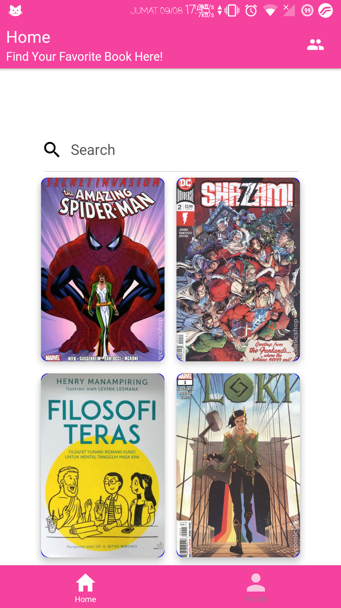
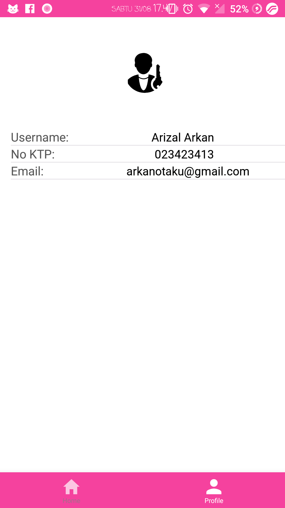

<h1 align='center'>Library</h1>

Simple Library App

## Table Of Content
- [Introduction](#introduction)
- [Features](#features)
- [Requirements](#requirements)
- [Usage](#usage-for-development)
- [Screenshots](#screenshots)
- [Release APK](#release-apk)

## Introduction
Simple Library App, you can borrow see detail etc.

## Features
* Borrow
* See detail
* Add Book, Edit and Delete

## Requirements
* [`npm`](https://www.npmjs.com/get-npm)
* [`react-native`](https://facebook.github.io/react-native/docs/getting-started)
* [`react-native-cli`](https://facebook.github.io/react-native/docs/getting-started)
* [`Setting RESTFUL API`](https://firebase.google.com/)

## Usage for development
1. Open your terminal or command prompt
2. Type `git clone https://github.com/Arizal-Arkan/React-Native-Library.git`
3. Open the folder and type `npm install` for install dependencies and `react-native link`
4. Before run this, you must setting configure on a backend 
5. Type `react-native run-android` for run this app. Don't forget to active debugging mode in your device

## Screenshots

        
        

